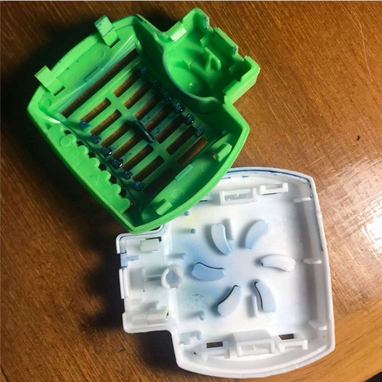

# esp8266路由刷机指南

这是esp8266模块：

这是ttl刷机连接图：

这是我用面包板做的esp8266刷机器：

之后使用esp8266的刷机工具，把AP固件刷进去。

然后手机连接到MyAP热点

输入192.168.4.1，就可以愉快地设置了。

注意，STA settings 中设置你要要连接的wifi。不要勾选Automesh，之后点击Connect按钮。

几秒后会返回一个无法访问的界面，因为esp8266设置好会自动重启，这个时候页面就断开了。这时重新连接MyAP热点，然后再打开192.168.4.1，设置AP settings。

同样设置后会返回无法访问的页面。接下来按照你设置的wifi热点和密码就可以连接了。

# 驱蚊器硬改连路由器

但是使用的时候，总不能就这样插着吧。所以，需要一个壳子。

现在，我找到一个驱蚊器。

把它拆开，里面有足够的空间。

现在需要1个220v转5v的降压模块和1个5v降压3.3v的降压模块，因为esp8266使用3.3v。
把它们和esp8266焊接起来。

先不扣上壳子，直插220v试一下，手机是可以上网的。

现在扣上盖子。

最终效果：

喜欢的朋友欢迎加我微信：cr4fun
